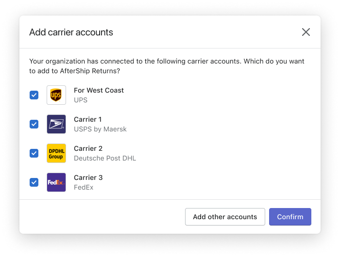
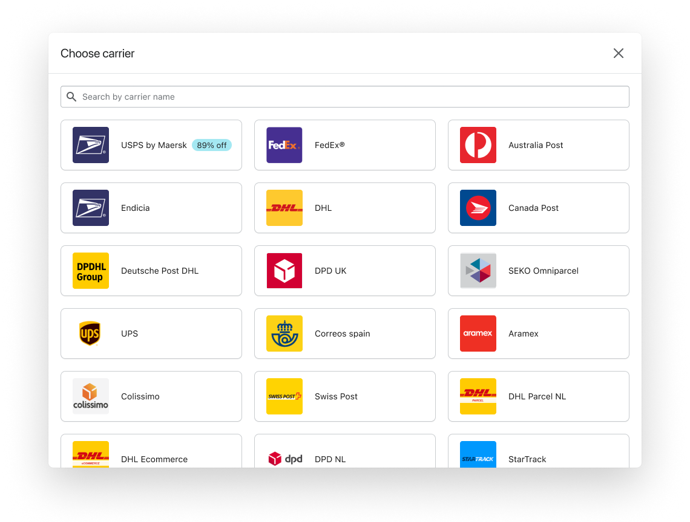
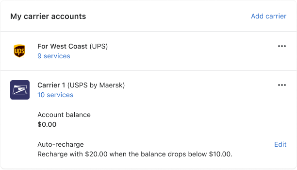
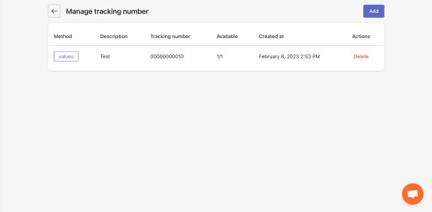

# @aftership/shipping-components

This project was provide shipping ability to which product like returns

### Development Setup
```shell
yarn                    # install
yarn example            # run example
yarn build              # run build
```

### Directory structure
``` 
shipping-components
├── README.md
├── example                                 # Demo for dev
├── package.json
├── src
│   ├── components
│   │   ├── [Component Name]
│   │   │   ├── index.ts
│   │   │   ├── [Component Name].scss
│   │   │   └── [Component Name].tsx        # Component with UI logics only
│   ├── constants
│   ├── container
│   │   ├── [Container Name]
│   │   │   └── [Container Name].tsx        # Component with context data or business logic
│   ├── hooks                               # React hooks
│   ├── images
│   ├── index.ts                            # Component and hooks export
│   ├── queries                             # Request hooks
│   │   ├── [Source Name]
│   │   │   ├── [Source Name].ts
│   │   │   └── types.d.ts
│   ├── types                               # Typescript definitions
│   └── utils                               # Tools and helpers
├── tsconfig.build.json
├── tsconfig.json
├── vite.config.example.ts
├── vite.config.ts
├── yarn-error.log
└── yarn.lock
```

### Usage
#### `useCarrierAccountManagerModal`
Open to show the carrier account under organization that is not added to this product side.

`useCarrierAccountManagerModal` allows you to specify extra options:
- `onSave` &mdash; Callback for confirm imported account
- `onClickAddNewAccount` &mdash; Callback when click on the button that serves as the entry point for the newly created carrier



#### `useCarrierListModal`
Open to show all the carrier options that are supported to be added on the product side.

`useCarrierListModal` allows you to specify extra options:
- `onClick` &mdash; Callback for click to select the specific carrier
- `onCarrierItemSave` &mdash; Callback for successful carrier creation

  

#### `useAddCarrierModal`
Open to show the form content that needs to be added when creating a carrier account.
`useCarrierListModal` already contains the logic for `useAddCarrierModal`, but the latter can also be used on its own.

`useAddCarrierModal` allows you to specify extra options:
- `onSave` &mdash; Callback for successful carrier creation

#### `CarrierAccountList`
Show the added carrier account on the product side.



#### `TrackingNumberPage`
Some carrier providers require a tracking number, we have wrapped up a page that you need to bring in to place in your project, create a corresponding route and provide the path name to `trackingNumberPagePathName` config in `CarrierManagerProvider`.
```tsx
//Routes.tsx

import { TrackingNumberPage } from '@aftership/shipping-components';

<Route exact path="/shipping/tracking-number" component={TrackingNumberPage} />
 
```
we will navigate to the tracking-number page when click the tracking number button in carrier account list.




### Getting Started
To use a function call component, you need to provide a provider in the outer layer, otherwise you can just introduce the component and use it.

```tsx
// Page.tsx

import { CarrierManagerProvider } from '@aftership/shipping-components';

const config = {
    productName: 'AfterShip Shipping',
    trackingNumberPagePathName: '/shipping/tracking-number',
    text: {
        removeBanner: '',
    },
    billing: {
        currentPlanName: '',
        carrierAccountQuota: 3,
        onUpgrade: () => {},
    },
};

retrun (
    <CarrierManagerProvider>
        <CarrierPage />
    </CarrierManagerProvider>
)


```

```tsx
// CarrierPage.tsx

import {
    CarrierAccountList,
    useCarrierListModal,
    useCarrierAccountManagerModal,
} from '@aftership/shipping-components';

const {open: openCarrierAccountManagerModal} = useCarrierAccountManagerModal({
    onSave: () => {},
});

const {open: openCarrierListModal} = useCarrierListModal({
    onClick: () => {},
});

return (
    <>
        <Button onClick={openCarrierAccountManagerModal}>Open org accounts</Button>
        <Button onClick={openCarrierListModal}>Open carrier list</Button>
        <CarrierAccountList
            renderChildren={() => {
                return <>customize element</>;
            }}
        />
    </>
);
```
